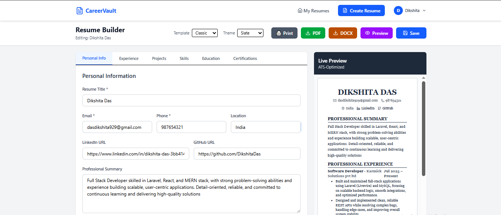
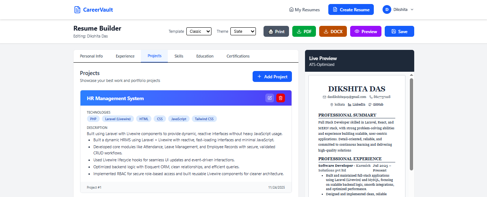
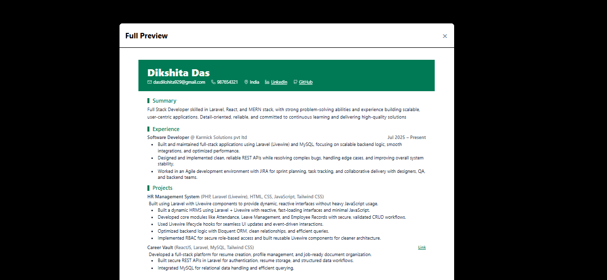

<h1 align="center">🗂️ CareerVault</h1>

<p align="center">
  A modern full-stack <b>Resume & Career Profile Management</b> application built with <b>React, Laravel, MySQL & Tailwind CSS</b>.
</p>

<p align="center">
  <a href="https://github.com/DikshitaDas/careervault"></a>
  <a href="https://github.com/DikshitaDas/careervault/issues"></a>
  
  
</p>

---

CareerVault helps users **build, manage, and organize professional resumes and career profiles** through a clean, elegant, and intuitive UI.  
It combines a **React-powered frontend** with a **secure Laravel REST API**, providing structure, speed, and modern usability — perfect for job seekers, professionals, or anyone building a career identity.

---

## ✨ Features

* 🔐 **User Authentication & Profiles**
  Secure login and personalized resume management.

* 📝 **Resume Builder & Manager**
  Add Experience, Education, Projects, Skills, Certifications — all structured beautifully.

* 🎨 **Two Professional Resume Templates**
  CareerVault includes **both Classic and Modern CV templates**, offering users a choice between a traditional professional layout and a clean, contemporary design.
  Each template is optimized for ATS compatibility, readability, and clean spacing.

* 📄 **Live Preview System**
  Users can switch between templates and instantly see updated resume content in a real-time preview pane.

* ⚙️ **Powerful Backend**
  Laravel API with proper validation, routing, and scalable structure.

* 🗄️ **Persistent Database Storage**
  Store structured resume fields securely in **MySQL** using Eloquent ORM.

* 📂 **Project Highlights & Achievements**
  Showcase your best work clearly for recruiters.

---


## 🧱 Tech Stack

### 🖥️ Frontend
- ⚛️ React JS  
- 🎨 Tailwind CSS  
- 🔗 Axios / Fetch  
- 🧭 React Router  

### 🛠 Backend
- 🐘 PHP (Laravel)  
- 🗄 MySQL  
- 🧩 Eloquent ORM  
- 🔒 Authentication (Laravel Auth / Sanctum / JWT)  

### 🧰 Developer Tools
- Git & GitHub  
- Composer  
- Node.js + npm  
- Postman / Thunder Client  
- VS Code  

---

## ⚙️ Setup & Installation

### 1️⃣ Clone Repository

```bash
git clone https://github.com/DikshitaDas/careervault.git
cd careervault
```

---

### 2️⃣ Backend Setup (Laravel)

```bash
cd backend

composer install

cp .env.example .env

php artisan key:generate

# Configure DB in .env
# DB_DATABASE=careervault

php artisan migrate

php artisan serve
```

Backend URL:  
👉 `http://127.0.0.1:8000`

---

### 3️⃣ Frontend Setup (React + Vite)

```bash
cd ../frontend

npm install
npm run dev
```

Frontend URL:  
👉 `http://localhost:5173`

Ensure API base URL in frontend `.env` or config points to your backend.

---

## 🧪 Usage

1. Register or log in  
2. Create your career profile  
3. Add sections like:  
   - Experience  
   - Skills  
   - Education  
   - Projects  
   - Certifications  
4. Update anytime  
5. Preview or export (if enabled)

---

## 🖼️ Screenshots (Optional)

Place images inside `/screenshots` folder.

```md
### Dashboard


### Resume Builder


### Preview

```

---

## 🛣️ Roadmap / Future Enhancements

- [ ] PDF export feature  
- [ ] Multiple resume templates  
- [ ] Dark mode  
- [ ] Public profile share link  
- [ ] Job listing or application tracker  

---

## 🤝 Contributing

Contributions are welcome!

```bash
# Fork → Create Branch → Commit → Push → PR
```

Steps:
1. Fork the repo  
2. Create new branch: `feature/amazing-feature`  
3. Commit: `git commit -m "Add amazing feature"`  
4. Push  
5. Open PR  

---

## 📜 License

Licensed under **MIT** — free to use, modify, and distribute with attribution.

---

## 👩‍💻 Author

**Dikshita Das**  
*Full Stack Developer — Laravel | React | MERN*

📧 Email: **[dasdikshita929@gmail.com](mailto:dasdikshita929@gmail.com)**  
🐙 GitHub: **[@DikshitaDas](https://github.com/DikshitaDas)**  
💼 LinkedIn: **[@dikshita-das](https://www.linkedin.com/in/dikshita-das-3bb414203/)**  

> ⭐ If you like this project, please star the repo!

